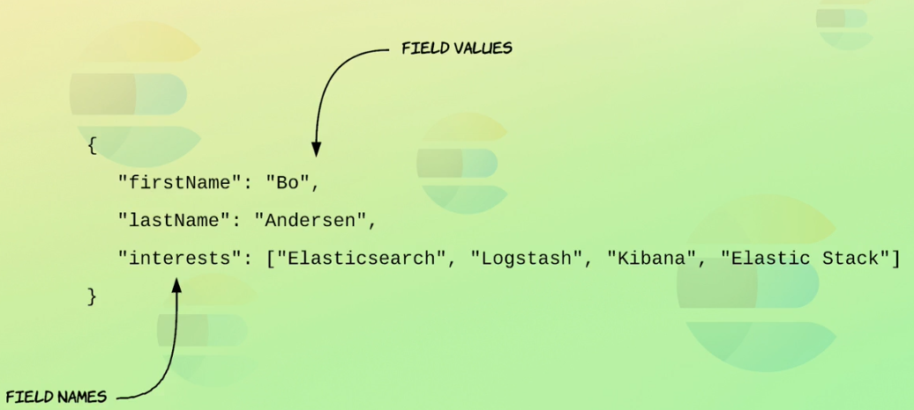

1. what is Elasticsearch?
open source analytics and full-text search engine.

- you can build complex search functionality with elasticsearch.
- APM: application performance management  --> it is a common use case for elasticsearch and elastic stack.

- elasticsearch is excellent at analyzing lots of data
- data is stored as document similar to rows in relational databases.

