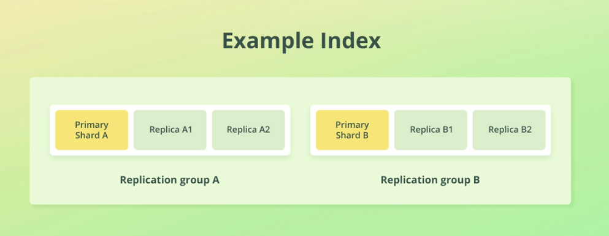

1. Replication is configured at the index level

2. Replication works by creating copies of shards, referred to as replica shards

3. A shard that has been replicated, is called a `primary shard`

4. A primary shard and its replica shards are referred to as a `replication group`

5. Replica shards are a complete copy of a shard

6. A replica shard can serve search requests, exactly like its primary shard

7. The number of replicas can be configured at index creation
8. 

9. replica shard never store on same node as its primary shard, because if any fail over on disk happen; then replication does not help.

10. Elasticsearch supports taking snapshots as backup. snapshots can be used to be able to restore to specifc point of time. snapshots can be taken at index level or entire cluster.

11. snapshot are commonly use for daily backup just to make sure there is a way for rollback the changes if something went wrong whereas replication ensures the indices can recover from node failure and keep serving requests.