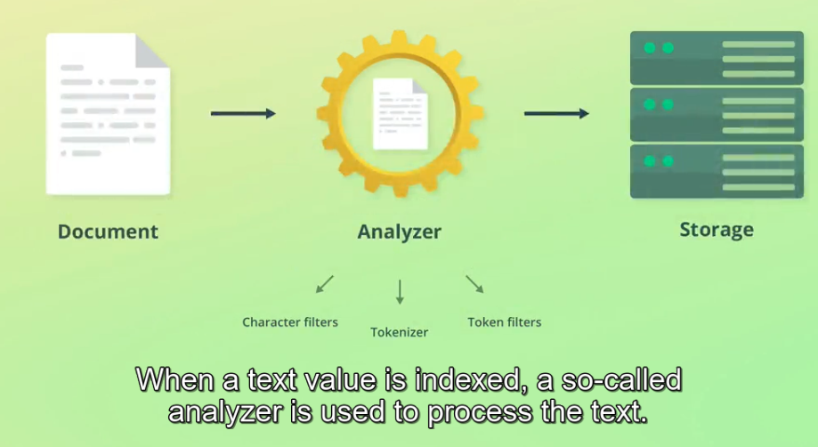

1. Text values are analyzed when indexing documents.


2. An analyzer consists of three building blocks:
   - character filters
   - tokenizer
   - token filters

3. the result of analyzing text values is then stored in a searchable data structure.
4. we can use analyzer API for testing:

```json
POST /_analyze
{
  "text": "2 guys walk into a bar, but the third... DUCKS! :->",
  "analyzer": "standard"
}
```


```json
POST /_analyze
{
  "text": "2 guys walk into a bar, but the third... DUCKS! :->",
  "char_filter": [],
  "tokenizer": "standard",
  "filter": ["lowercase"]
}
```


