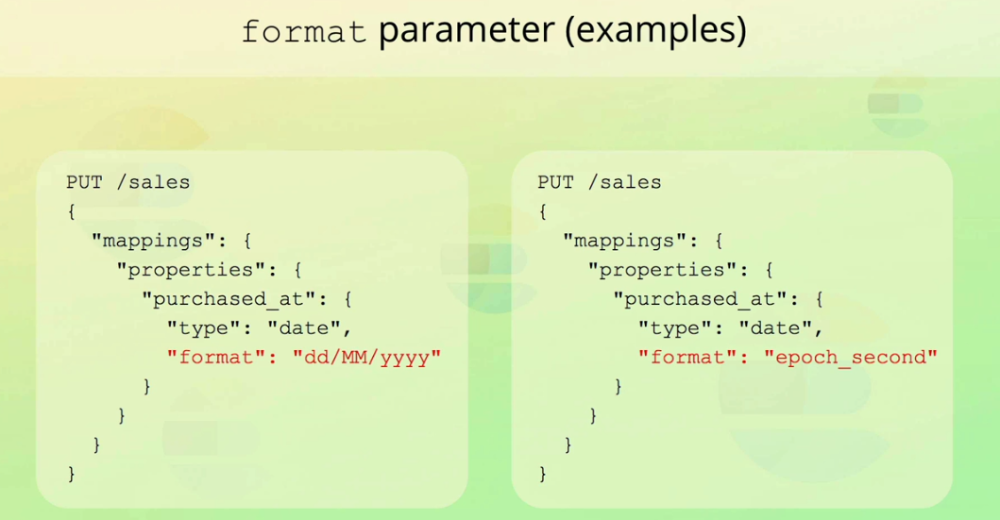
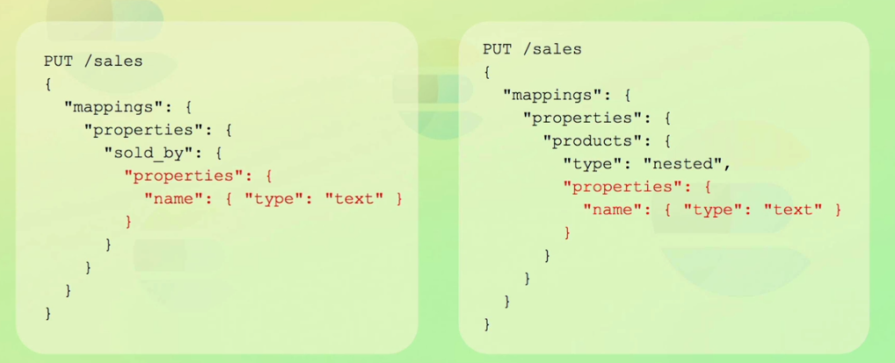
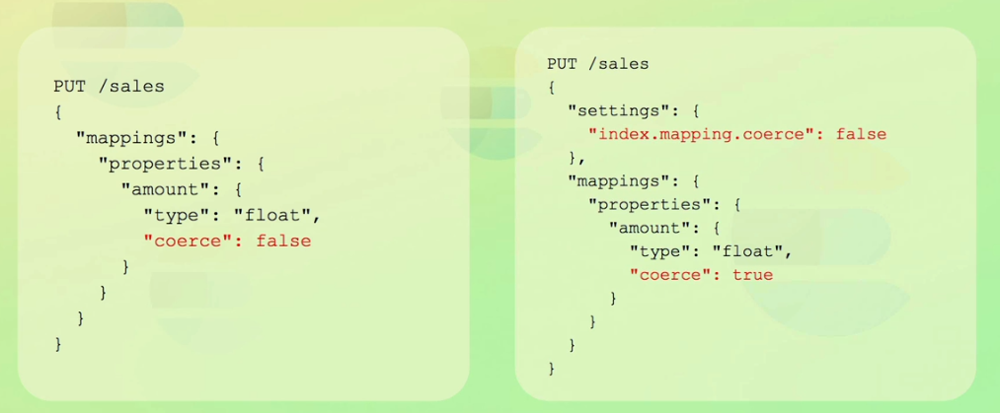
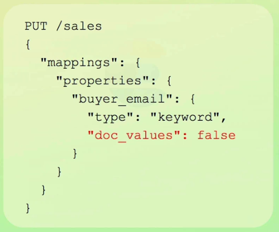

### Mapping Parameters

Elasticsearch mappings define how documents and their fields are stored and indexed.

#### list the most important mapping parameters

1. format:
    used to customize the format for  "date" fields.
    this parameter is used to specify the date format when you want to index dates that are not formatted in the default format. 




2. properties
    define nested fields for "object" and nested fields.




3. coerce 
    used to enable or disable coercion of values (enabled by default)

**note**: it's also possible to configure coercion at index level. fields inherits this index level setting but you can overwrite it for each field in the index.




4. doc_values
   is another data structure used by Apache Lucene\
   optimized for a different data access pattern (document -> term)
   essencially an "uninverted" inverted index
   set "doc_values" parameter to "False" to save disk space --> slightly increases the indexing throughput

**note** only disable "doc values" if you won't use aggregations, sorting, or scripting
**note** it's important to note that if you disable "doc values", you can not change this without reindexing all of your data





5. norms
    used for `relevance scoring`\
    often we do'nt just want to filter results, but also rank them


6. index
   disable indexing for a field -> then this field wo'nt be the part of data stucture which is used for searching\
   useful if you won't use a field for search queries\
   even if you disabled a field for indexing, you can still use it for aggregations


7. null_value
   NULL values are ignored in Elasticsearch, meaning they cannot indexed or searched. the same applied for empty array or array of nulls.

   - NULL values cannot be indexed or searched
   - Use this parameter to replace NULL values with another value
   - Only works for explicit NULL values
   - The replacement value must be of the same data type as the field
   - Does not affect the value stored within _source


sample:

```json
PUT /products
{
  "mappings": {
    "properties": {
      "rating": {
        "type": "integer",
        "null_value": 0  // Replace null with 0
      },
      "comment": {
        "type": "keyword",
        "null_value": "N/A"  // Replace null with "N/A"
      }
    }
  }
}
```


8. copy_to
    used to copy multiple field values into a "group field"\
    The copy_to parameter in Elasticsearch allows you to copy the values of multiple fields into a combined target field, which can then be used for search or analysis.


    example:

```json
PUT /products
{
  "mappings": {
    "properties": {
      "title": {
        "type": "text",
        "copy_to": "full_text_search"  // Copy to a custom field
      },
      "description": {
        "type": "text",
        "copy_to": "full_text_search"  // Also copied here
      },
      "full_text_search": {  // Target field (not in _source)
        "type": "text"
      }
    }
  }
}
```


Document indexing:

```json
POST /products/_doc/1
{
  "title": "Wireless Headphones",
  "description": "Noise-cancelling Bluetooth headphones"
}
```


The full_text_search field will contain:

```json
"Wireless Headphones Noise-cancelling Bluetooth headphones".
```


